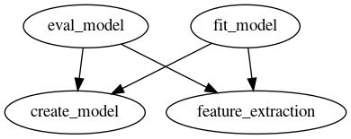

agrocode
==============================

A hometask with data from AgroCode competition

Потенциальные проблемы с воспроизводимостью:

 - [x] неправильная версия питона. Необходим python=3.7.6
 - [x] не установлены подходящие версии библиотек
Решение:
1. Сделать виртуальное окружение и активировать его
```bash
python -m venv create venv
source venv/bin/activate
```
2. Установить подходящие библиотеки
```bash
pip install -U pip
pip install -r requirements.txt
```
3. Не установлен graphviz

## DVC pipelines
Граф пайплайна 


